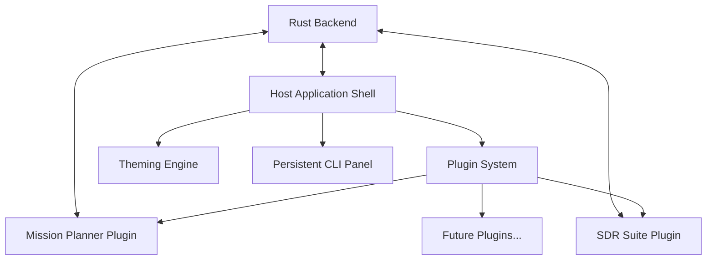

# Design Document: Modular Command & Control (C2) Svelte Frontend

## Overview

The Modular Command & Control (C2) Svelte Frontend is designed as a lightweight, performant, and ultra-reliable user interface for aerospace command and control operations. It follows a modular architecture where the frontend serves purely as a visualization and user-input layer, with all mission-critical logic residing in the Rust backend.

This design document outlines the architecture, components, interfaces, data models, error handling, and testing strategy for implementing the frontend based on the requirements.

## Architecture

The application follows a modular, plugin-based architecture with a clear separation of concerns:

### High-Level Architecture



### Key Architectural Principles

1. **Separation of Concerns**: The frontend is strictly responsible for visualization and user input, while all mission-critical logic resides in the Rust backend.
2. **Modular Plugin System**: Core functionality is implemented as self-contained plugins, each consisting of a Rust backend component and corresponding Svelte components.
3. **Centralized Theming**: All visual aspects are controlled through a centralized theming engine with no hardcoded styles.
4. **Event-Driven Communication**: Frontend and backend communicate through well-defined Tauri commands and events.
5. **Component-Driven UI**: Complex interfaces like the Mission Planner are built from composable, reusable components.

## Components and Interfaces

### 1. Host Application Shell

The Host Application Shell provides the main window structure, state management, and plugin loading mechanism.

#### Key Components:

- **App.svelte**: The root component that sets up the application structure.
- **+layout.svelte**: The SvelteKit layout component that applies theming and sets up the basic page structure.
- **PluginDashboard.svelte**: Displays the grid of plugin cards on the home screen.
- **PluginCard.svelte**: Represents a single plugin in the dashboard grid.
- **PluginContainer.svelte**: Dynamically loads and renders the active plugin.

#### State Management:

```typescript
// stores/plugins.ts
import { writable } from 'svelte/store';
import { invoke } from '@tauri-apps/api/tauri';

export interface Plugin {
  id: string;
  name: string;
  description: string;
  icon: string;
}

export const plugins = writable<Plugin[]>([]);
export const activePlugin = writable<string | null>(null);

export async function loadPlugins() {
  try {
    const loadedPlugins = await invoke('get_loaded_plugins');
    plugins.set(loadedPlugins);
  } catch (error) {
    console.error('Failed to load plugins:', error);
  }
}

export async function activatePlugin(pluginId: string) {
  activePlugin.set(pluginId);
}

export async function returnToDashboard() {
  activePlugin.set(null);
}
```

### 2. Persistent CLI Panel

The CLI Panel provides direct access to the application's underlying CLI suite.

#### Key Components:

- **CliPanel.svelte**: The container component for the CLI panel.
- **CliView.svelte**: Uses xterm.js to render a full-featured terminal.
- **CliResizer.svelte**: Handles the resizing functionality for the CLI panel.

#### Interface:

```typescript
// components/cli/CliView.svelte
<script lang="ts">
  import { onMount, onDestroy } from 'svelte';
  import { Terminal } from 'xterm';
  import { FitAddon } from 'xterm-addon-fit';
  import { invoke } from '@tauri-apps/api/tauri';
  import { listen } from '@tauri-apps/api/event';
  import { theme } from '../../stores/theme';

  let terminal: Terminal;
  let fitAddon: FitAddon;
  let terminalElement: HTMLElement;
  let unlisten: () => void;

  onMount(async () => {
    // Initialize terminal
    terminal = new Terminal({
      fontFamily: $theme.typography.font_family_mono,
      fontSize: parseInt($theme.typography.font_size_base),
      theme: {
        background: $theme.components.cli.background,
        foreground: $theme.components.cli.text_color,
        cursor: $theme.components.cli.cursor_color,
        cursorAccent: $theme.components.cli.background,
      }
    });

    fitAddon = new FitAddon();
    terminal.loadAddon(fitAddon);
    terminal.open(terminalElement);
    fitAddon.fit();

    // Write welcome message
    terminal.writeln('Welcome to Aerospace C2 Command Line Interface');
    terminal.writeln('Type "help" for available commands');

    // Listen for CLI output events
    unlisten = await listen('cli-output', (event) => {
      const { line, stream } = event.payload as { line: string, stream: 'stdout' | 'stderr' };

      // Apply different styling based on stream type
      if (stream === 'stderr') {
        terminal.writeln(`\x1b[31m${line}\x1b[0m`); // Red text for stderr
      } else {
        terminal.writeln(line);
      }
    });

    // Handle user input
    terminal.onData((data) => {
      // Send command to backend when Enter is pressed
      if (data === '\r') {
        const currentLine = terminal.buffer.active.getLine(terminal.buffer.active.cursorY)?.translateToString();
        if (currentLine) {
          invoke('run_cli_command', { command: currentLine.trim() });
        }
      }
    });
  });

  onDestroy(() => {
    if (unlisten) unlisten();
    if (terminal) terminal.dispose();
  });
</script>

<div class="cli-container" bind:this={terminalElement}></div>

<style>
  .cli-container {
    width: 100%;
    height: 100%;
    overflow: hidden;
  }
</style>
```

### 3. Theming Engine

The Theming Engine provides a centralized mechanism for styling the entire application.

#### Key Components:

- **ThemeProvider.svelte**: Loads the theme and applies it to the application.
- **themeStore.ts**: A Svelte store that holds the current theme.

#### Interface:

```typescript
// stores/theme.ts
import { writable } from 'svelte/store';
import { fs } from '@tauri-apps/api';

export interface Theme {
  name: string;
  metadata: {
    author: string;
    version: string;
  };
  colors: {
    background_primary: string;
    background_secondary: string;
    background_tertiary: string;
    text_primary: string;
    text_secondary: string;
    text_disabled: string;
    accent_yellow: string;
    accent_blue: string;
    accent_red: string;
    accent_green: string;
  };
  typography: {
    font_family_sans: string;
    font_family_mono: string;
    font_size_base: string;
    font_size_lg: string;
    font_size_sm: string;
  };
  layout: {
    border_radius: string;
    border_width: string;
    spacing_unit: string;
  };
  components: {
    cli: {
      background: string;
      text_color: string;
      cursor_color: string;
      cursor_shape: string;
    };
    map: {
      waypoint_color_default: string;
      waypoint_color_selected: string;
      path_color: string;
      geofence_color: string;
    };
    button: {
      background_default: string;
      text_color_default: string;
      background_hover: string;
      background_accent: string;
      text_color_accent: string;
    };
    plugin_card: {
      background: string;
      background_hover: string;
      icon_color: string;
      text_color: string;
      border_radius: string;
    };
    accordion: {
      background: string;
      border_color: string;
      header_text_color: string;
    };
    hex_coin: {
      background: string;
      icon_color: string;
      border_color_default: string;
      border_color_pinned: string;
      snap_point_color: string;
    };
  };
}

export const theme = writable<Theme>(null);

export async function loadTheme(themeName = 'super_amoled_black') {
  try {
    const themeContent = await fs.readTextFile(`static/themes/${themeName}.json`);
    const themeData = JSON.parse(themeContent);
    theme.set(themeData);
    return themeData;
  } catch (error) {
    console.error('Failed to load theme:', error);
    // Load fallback theme
    const fallbackTheme = await fs.readTextFile('static/themes/super_amoled_black.json');
    const fallbackData = JSON.parse(fallbackTheme);
    theme.set(fallbackData);
    return fallbackData;
  }
}
```

```svelte
<!-- ThemeProvider.svelte -->
<script lang="ts">
  import { onMount } from 'svelte';
  import { theme, loadTheme } from '../stores/theme';

  export let themeName = 'super_amoled_black';

  onMount(async () => {
    await loadTheme(themeName);
  });

  $: if ($theme) {
    applyThemeToRoot($theme);
  }

  function applyThemeToRoot(themeData) {
    // Apply colors
    Object.entries(themeData.colors).forEach(([key, value]) => {
      document.documentElement.style.setProperty(`--color-${key}`, value);
    });

    // Apply typography
    Object.entries(themeData.typography).forEach(([key, value]) => {
      document.documentElement.style.setProperty(`--typography-${key}`, value);
    });

    // Apply layout
    Object.entries(themeData.layout).forEach(([key, value]) => {
      document.documentElement.style.setProperty(`--layout-${key}`, value);
    });

    // Apply component-specific variables
    Object.entries(themeData.components).forEach(([component, properties]) => {
      Object.entries(properties).forEach(([key, value]) => {
        document.documentElement.style.setProperty(`--component-${component}-${key}`, value);
      });
    });
  }
</script>

<slot />
```

### 4. Mission Planner Plugin

The Mission Planner Plugin provides a component-driven interface for creating and managing vehicle missions.

#### Key Components:

- **MissionPlanner.svelte**: The main component with a two-panel layout.
- **MapViewer.svelte**: Displays the map using MapLibre GL JS.
- **MissionAccordion.svelte**: Displays mission components in an accordion.
- **WaypointItem.svelte**: Represents a waypoint in the accordion.
- **MinimizedCoin.svelte**: Represents a minimized mission component.

#### Interface:

```svelte
<!-- MissionPlanner.svelte -->
<script lang="ts">
  import MapViewer from './MapViewer.svelte';
  import MissionAccordion from './MissionAccordion.svelte';
  import { missionItems } from '../../stores/mission';

  let selectedItemId: string | null = null;

  function handleItemSelect(event) {
    selectedItemId = event.detail.itemId;
  }

  function handleMapClick(event) {
    // Handle map click events
  }
</script>

<div class="mission-planner">
  <div class="map-container">
    <MapViewer {selectedItemId} on:mapclick={handleMapClick} />
  </div>
  <div class="accordion-container">
    <MissionAccordion items={$missionItems} {selectedItemId} on:select={handleItemSelect} />
  </div>
</div>

<style>
  .mission-planner {
    display: flex;
    height: 100%;
    width: 100%;
  }

  .map-container {
    flex: 1;
    min-width: 50%;
  }

  .accordion-container {
    width: 350px;
    overflow-y: auto;
    background-color: var(--color-background_secondary);
  }

  @media (max-width: 768px) {
    .mission-planner {
      flex-direction: column;
    }

    .map-container,
    .accordion-container {
      width: 100%;
      height: 50%;
    }
  }
</style>
```

```svelte
<!-- MissionAccordion.svelte -->
<script lang="ts">
  import { createEventDispatcher } from 'svelte';
  import { invoke } from '@tauri-apps/api/tauri';
  import WaypointItem from './WaypointItem.svelte';
  import { flip } from 'svelte/animate';

  export let items = [];
  export let selectedItemId = null;

  const dispatch = createEventDispatcher();

  function handleSelect(itemId) {
    dispatch('select', { itemId });
  }

  async function handleReorder(event) {
    const { itemId, newIndex } = event.detail;
    await invoke('reorder_mission_item', { itemId, newIndex });
  }
</script>

<div class="mission-accordion">
  {#each items as item, index (item.id)}
    <div animate:flip={{ duration: 300 }}>
      <WaypointItem
        {item}
        isSelected={selectedItemId === item.id}
        on:select={() => handleSelect(item.id)}
        on:minimize={() => {
          /* Handle minimize */
        }}
        on:update={async (e) => {
          await invoke('update_waypoint_params', {
            waypointId: item.id,
            params: e.detail.params
          });
        }}
      />
    </div>
  {/each}
</div>

<style>
  .mission-accordion {
    background-color: var(--component-accordion-background);
    border-color: var(--component-accordion-border_color);
  }
</style>
```

```svelte
<!-- MinimizedCoin.svelte -->
<script lang="ts">
  import { createEventDispatcher } from 'svelte';
  import { spring } from 'svelte/motion';

  export let item;
  export let isPinned = false;

  const dispatch = createEventDispatcher();

  // Position spring for smooth dragging
  const position = spring(
    { x: 0, y: 0 },
    {
      stiffness: 0.2,
      damping: 0.4
    }
  );

  let dragging = false;
  let dragOffset = { x: 0, y: 0 };

  function handleMouseDown(event) {
    dragging = true;
    const rect = event.currentTarget.getBoundingClientRect();
    dragOffset.x = event.clientX - rect.left;
    dragOffset.y = event.clientY - rect.top;
  }

  function handleMouseMove(event) {
    if (dragging && !isPinned) {
      position.set({
        x: event.clientX - dragOffset.x,
        y: event.clientY - dragOffset.y
      });
    }
  }

  function handleMouseUp() {
    dragging = false;
  }

  function handleClick() {
    dispatch('togglePin');
  }

  function handleDoubleClick() {
    dispatch('expand');
  }
</script>

<svelte:window on:mousemove={handleMouseMove} on:mouseup={handleMouseUp} />

<div
  class="hex-coin {isPinned ? 'pinned' : ''}"
  style="transform: translate({$position.x}px, {$position.y}px)"
  on:mousedown={handleMouseDown}
  on:click={handleClick}
  on:dblclick={handleDoubleClick}
>
  <div class="icon">
    <!-- Icon based on item type -->
    {#if item.type === 'takeoff'}
      <svg><!-- Takeoff icon --></svg>
    {:else if item.type === 'waypoint'}
      <svg><!-- Waypoint icon --></svg>
    {:else if item.type === 'land'}
      <svg><!-- Land icon --></svg>
    {/if}
  </div>
</div>

<style>
  .hex-coin {
    width: 60px;
    height: 60px;
    position: absolute;
    clip-path: polygon(50% 0%, 100% 25%, 100% 75%, 50% 100%, 0% 75%, 0% 25%);
    background-color: var(--component-hex_coin-background);
    display: flex;
    align-items: center;
    justify-content: center;
    cursor: move;
    user-select: none;
    border: 2px solid var(--component-hex_coin-border_color_default);
    z-index: 100;
  }

  .hex-coin.pinned {
    border-color: var(--component-hex_coin-border_color_pinned);
  }

  .icon {
    color: var(--component-hex_coin-icon_color);
    font-size: 24px;
  }
</style>
```

### 5. SDR Suite Plugin

The SDR Suite Plugin provides visualization for radio frequency data.

#### Key Components:

- **SdrDashboard.svelte**: The main component for the SDR Suite.
- **SpectrumVisualizer.svelte**: Displays FFT data.
- **Waterfall.svelte**: Displays a waterfall visualization.

#### Interface:

```svelte
<!-- SdrDashboard.svelte -->
<script lang="ts">
  import { onMount, onDestroy } from 'svelte';
  import { listen } from '@tauri-apps/api/event';
  import SpectrumVisualizer from './SpectrumVisualizer.svelte';
  import Waterfall from './Waterfall.svelte';

  let fftData = [];
  let unlisten;

  onMount(async () => {
    unlisten = await listen('sdr-fft-data', (event) => {
      fftData = event.payload;
    });
  });

  onDestroy(() => {
    if (unlisten) unlisten();
  });
</script>

<div class="sdr-dashboard">
  <div class="spectrum-container">
    <SpectrumVisualizer data={fftData} />
  </div>
  <div class="waterfall-container">
    <Waterfall data={fftData} />
  </div>
</div>

<style>
  .sdr-dashboard {
    display: flex;
    flex-direction: column;
    height: 100%;
  }

  .spectrum-container {
    height: 40%;
    min-height: 200px;
  }

  .waterfall-container {
    flex: 1;
  }
</style>
```

## Data Models

### Plugin Model

```typescript
interface Plugin {
  id: string;
  name: string;
  description: string;
  icon: string;
}
```

### Theme Model

```typescript
interface Theme {
  name: string;
  metadata: {
    author: string;
    version: string;
  };
  colors: Record<string, string>;
  typography: Record<string, string>;
  layout: Record<string, string>;
  components: Record<string, Record<string, string>>;
}
```

### Mission Item Model

```typescript
interface MissionItem {
  id: string;
  type: 'takeoff' | 'waypoint' | 'loiter' | 'land' | string;
  name: string;
  params: Record<string, any>;
  position?: {
    lat: number;
    lng: number;
    alt: number;
  };
}
```

## Error Handling

The application implements a comprehensive error handling strategy:

1. **Frontend Error Boundaries**: Svelte components will be wrapped with error boundaries to prevent cascading failures.

```svelte
<!-- ErrorBoundary.svelte -->
<script lang="ts">
  import { onError } from 'svelte';

  let error = null;

  onError(({ error: e, message }) => {
    error = e;
    console.error('Caught error:', message);
  });
</script>

{#if error}
  <div class="error-container">
    <h3>Something went wrong</h3>
    <p>The application encountered an error. Please try refreshing the page.</p>
    <button on:click={() => window.location.reload()}>Refresh</button>
  </div>
{:else}
  <slot />
{/if}

<style>
  .error-container {
    padding: 1rem;
    background-color: var(--color-accent_red);
    color: white;
    border-radius: var(--layout-border_radius);
  }
</style>
```

2. **API Error Handling**: All Tauri command invocations will be wrapped in try/catch blocks.

```typescript
async function safeInvoke(command, args) {
  try {
    return await invoke(command, args);
  } catch (error) {
    console.error(`Error invoking ${command}:`, error);
    // Show error notification
    showNotification({
      type: 'error',
      message: `Failed to execute ${command}: ${error.message || 'Unknown error'}`
    });
    throw error;
  }
}
```

3. **Notification System**: A centralized notification system for displaying errors, warnings, and success messages.

```typescript
// stores/notifications.ts
import { writable } from 'svelte/store';

export interface Notification {
  id: string;
  type: 'info' | 'success' | 'warning' | 'error';
  message: string;
  timeout?: number;
}

export const notifications = writable<Notification[]>([]);

export function showNotification(notification: Omit<Notification, 'id'>) {
  const id = Date.now().toString();
  const newNotification = { ...notification, id };

  notifications.update((n) => [...n, newNotification]);

  if (notification.timeout !== 0) {
    setTimeout(() => {
      dismissNotification(id);
    }, notification.timeout || 5000);
  }

  return id;
}

export function dismissNotification(id: string) {
  notifications.update((n) => n.filter((notification) => notification.id !== id));
}
```

## Testing Strategy

The application will be tested using a comprehensive strategy:

1. **Unit Tests**: Individual components and functions will be tested in isolation.

```typescript
// Example unit test for theme store
import { loadTheme } from '../src/stores/theme';
import { get } from 'svelte/store';
import { theme } from '../src/stores/theme';

// Mock fs module
jest.mock('@tauri-apps/api/fs', () => ({
  readTextFile: jest.fn()
}));

describe('Theme Store', () => {
  beforeEach(() => {
    jest.resetAllMocks();
  });

  test('loadTheme should load and parse theme file', async () => {
    const mockTheme = {
      name: 'Test Theme',
      colors: { background_primary: '#000000' }
    };

    require('@tauri-apps/api/fs').readTextFile.mockResolvedValue(JSON.stringify(mockTheme));

    await loadTheme('test-theme');

    expect(get(theme)).toEqual(mockTheme);
  });

  test('loadTheme should fall back to default theme on error', async () => {
    const mockDefaultTheme = {
      name: 'Default Theme',
      colors: { background_primary: '#000000' }
    };

    require('@tauri-apps/api/fs')
      .readTextFile.mockRejectedValueOnce(new Error('File not found'))
      .mockResolvedValueOnce(JSON.stringify(mockDefaultTheme));

    await loadTheme('non-existent-theme');

    expect(get(theme)).toEqual(mockDefaultTheme);
  });
});
```

2. **Component Tests**: Testing Svelte components with Svelte Testing Library.

```typescript
// Example component test for PluginCard
import { render, fireEvent } from '@testing-library/svelte';
import PluginCard from '../src/components/PluginCard.svelte';

describe('PluginCard', () => {
  const mockPlugin = {
    id: 'test-plugin',
    name: 'Test Plugin',
    description: 'A test plugin',
    icon: 'test-icon'
  };

  test('renders plugin information correctly', () => {
    const { getByText, getByAltText } = render(PluginCard, { props: { plugin: mockPlugin } });

    expect(getByText('Test Plugin')).toBeInTheDocument();
    expect(getByText('A test plugin')).toBeInTheDocument();
    expect(getByAltText('Test Plugin icon')).toBeInTheDocument();
  });

  test('fires click event when clicked', async () => {
    const { component, getByTestId } = render(PluginCard, { props: { plugin: mockPlugin } });

    const mockClickHandler = jest.fn();
    component.$on('click', mockClickHandler);

    await fireEvent.click(getByTestId('plugin-card'));

    expect(mockClickHandler).toHaveBeenCalled();
    expect(mockClickHandler.mock.calls[0][0].detail.pluginId).toBe('test-plugin');
  });
});
```

3. **Integration Tests**: Testing the interaction between multiple components.

```typescript
// Example integration test for Mission Planner
import { render, fireEvent } from '@testing-library/svelte';
import MissionPlanner from '../src/plugins/mission-planner/MissionPlanner.svelte';
import { missionItems } from '../src/stores/mission';

// Mock Tauri API
jest.mock('@tauri-apps/api/tauri', () => ({
  invoke: jest.fn()
}));

describe('MissionPlanner Integration', () => {
  beforeEach(() => {
    // Reset mission items store
    missionItems.set([
      {
        id: 'waypoint-1',
        type: 'waypoint',
        name: 'Waypoint 1',
        position: { lat: 37.7749, lng: -122.4194, alt: 100 },
        params: { speed: 5 }
      },
      {
        id: 'waypoint-2',
        type: 'waypoint',
        name: 'Waypoint 2',
        position: { lat: 37.775, lng: -122.4195, alt: 120 },
        params: { speed: 7 }
      }
    ]);
  });

  test('selecting a waypoint in the accordion highlights it on the map', async () => {
    const { getByText, getByTestId } = render(MissionPlanner);

    // Click on the first waypoint in the accordion
    await fireEvent.click(getByText('Waypoint 1'));

    // Check that the map marker is highlighted
    const mapMarker = getByTestId('map-marker-waypoint-1');
    expect(mapMarker).toHaveClass('selected');
  });
});
```

4. **End-to-End Tests**: Testing the complete application flow using Playwright.

```typescript
// Example E2E test
import { test, expect } from '@playwright/test';

test('can navigate between plugins', async ({ page }) => {
  await page.goto('/');

  // Check that we're on the dashboard
  await expect(page.getByTestId('plugin-dashboard')).toBeVisible();

  // Click on the Mission Planner plugin
  await page.getByText('Mission Planner').click();

  // Check that we've navigated to the Mission Planner
  await expect(page.getByTestId('mission-planner')).toBeVisible();

  // Go back to dashboard
  await page.getByTestId('home-button').click();

  // Check that we're back on the dashboard
  await expect(page.getByTestId('plugin-dashboard')).toBeVisible();
});
```

This comprehensive testing strategy ensures that the application is robust, reliable, and meets all the requirements specified in the PRD.
