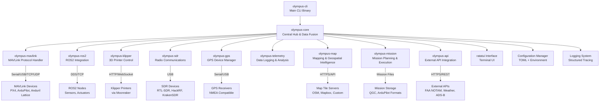
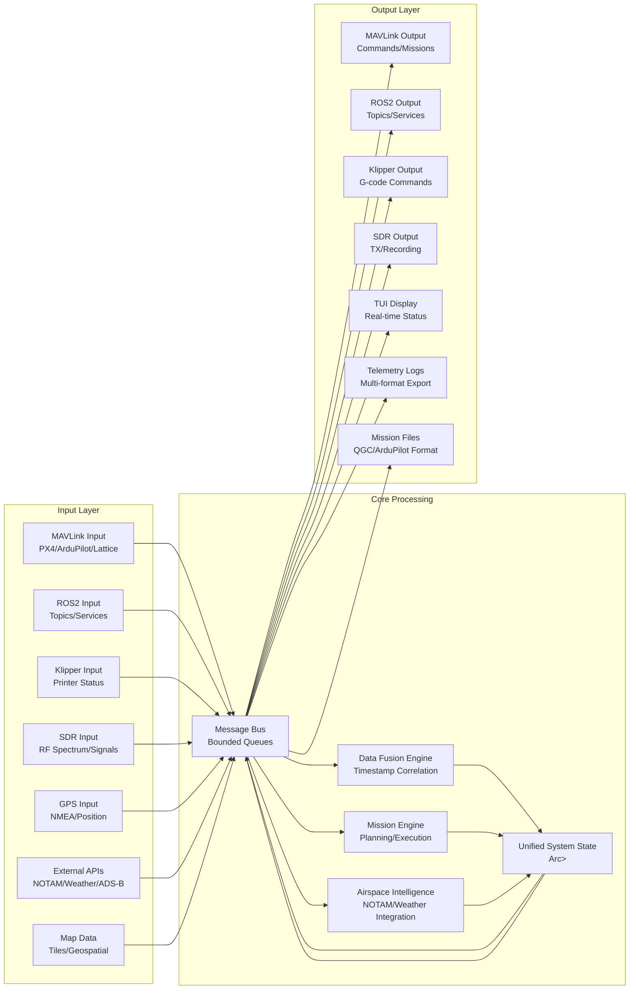
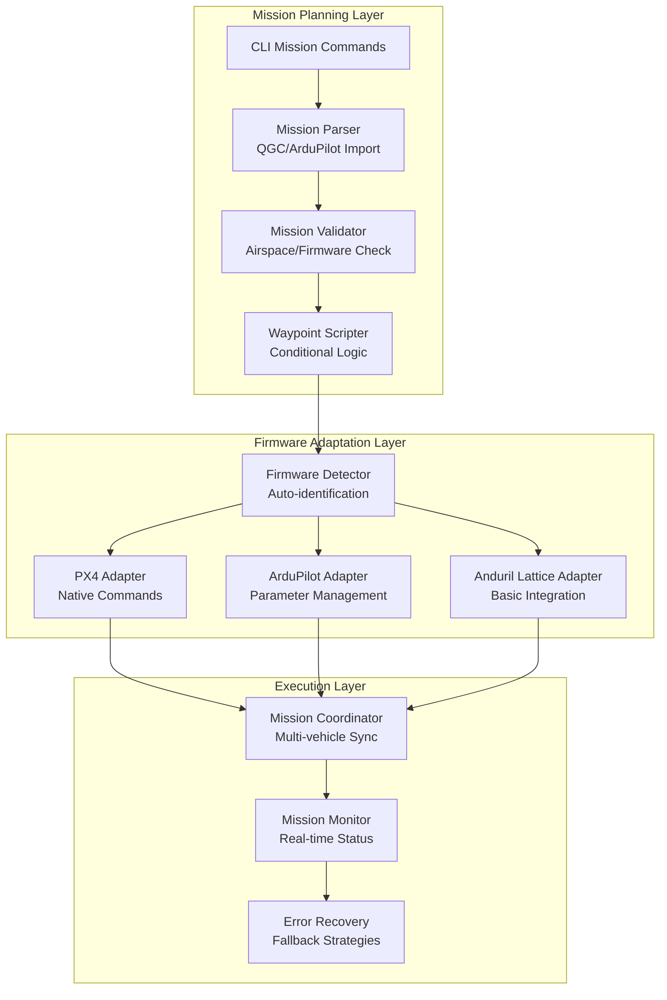
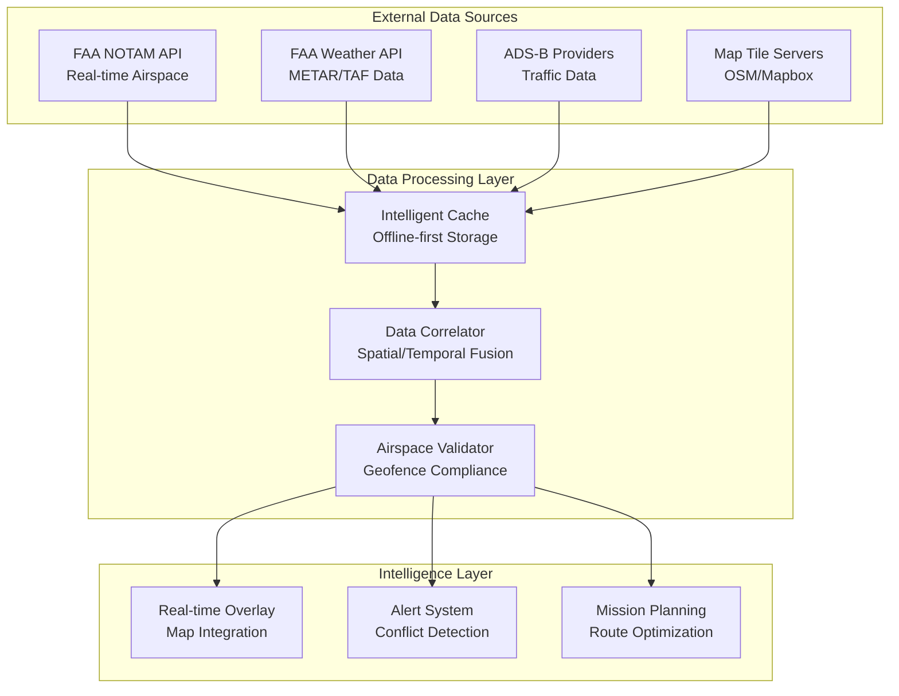

# Design Document

## Overview

The Olympus CLI Interconnectivity System is designed as a modular, NASA JPL Power of 10 compliant architecture that provides true interconnectivity between MAVLink, ROS2, Klipper, and SDR systems. The design emphasizes CLI-first operation with a ratatui terminal interface, real-time data fusion, and deterministic behavior suitable for mission-critical aerospace applications.

The system follows a hub-and-spoke architecture where the `olympus-core` acts as the central data fusion engine, with specialized crates handling protocol-specific communications. All subsystems communicate through a unified message bus with bounded queues and zero-copy data sharing where possible.

## Architecture

### High-Level System Architecture



### Data Flow Architecture



### Mission Planning Architecture



### Airspace Intelligence Integration



## Components and Interfaces

### Core Components

#### 1. olympus-core: Central Hub and Data Fusion Engine

**Primary Responsibilities:**

- Unified message bus with bounded queues (NASA JPL Rule 2)
- Real-time data fusion with timestamp correlation
- System state management with Arc<RwLock<SystemState>>
- Cross-subsystem communication routing
- Configuration management and validation
- Error handling and recovery coordination

**Key Interfaces:**

```rust
// Core message bus interface
pub trait MessageBus {
    fn publish<T: Message>(&self, topic: &str, message: T) -> Result<(), OlympusError>;
    fn subscribe<T: Message>(&self, topic: &str) -> Result<Receiver<T>, OlympusError>;
    fn health_check(&self) -> HealthStatus;
}

// Unified system state
pub struct SystemState {
    pub vehicles: BoundedVec<VehicleState, 16>,
    pub ros2_nodes: BoundedVec<ROS2NodeState, 32>,
    pub printers: BoundedVec<PrinterState, 4>,
    pub sdr_devices: BoundedVec<SDRDeviceState, 8>,
    pub gps_devices: BoundedVec<GPSDeviceState, 4>,
    pub last_update: Timestamp,
}

// Configuration management
pub trait ConfigManager {
    fn get<T: DeserializeOwned>(&self, key: &str) -> Result<T, OlympusError>;
    fn set<T: Serialize>(&self, key: &str, value: T) -> Result<(), OlympusError>;
    fn validate(&self) -> Result<(), Vec<ConfigError>>;
    fn hot_reload(&self) -> Result<(), OlympusError>;
}
```

#### 2. olympus-cli: Command Line Interface and TUI

**Primary Responsibilities:**

- Clap-based command parsing with subcommands
- Ratatui terminal user interface
- Real-time display updates with <100ms latency
- Command history and tab completion
- Context-sensitive help system

**Key Interfaces:**

```rust
// CLI command structure
#[derive(Parser)]
pub enum OlympusCommand {
    Mavlink(MavlinkCommands),
    Ros2(ROS2Commands),
    Klipper(KlipperCommands),
    Sdr(SDRCommands),
    Gps(GPSCommands),
    Map(MapCommands),
    Mission(MissionCommands),
    Api(ApiCommands),
    Config(ConfigCommands),
    Status(StatusCommands),
    Tui(TUICommands),
}

// Mission planning CLI commands
#[derive(Parser)]
pub enum MissionCommands {
    /// Create a new mission
    Create { name: String, description: Option<String> },
    /// List all missions
    List { filter: Option<String> },
    /// Edit an existing mission
    Edit { mission_id: String },
    /// Add waypoint to mission
    AddWaypoint {
        mission_id: String,
        lat: f64,
        lon: f64,
        alt: f32,
        action: Option<String>,
        script: Option<String>
    },
    /// Validate mission against airspace and firmware
    Validate { mission_id: String },
    /// Upload mission to vehicle
    Upload { mission_id: String, vehicle_id: String },
    /// Monitor active mission execution
    Monitor { mission_id: String },
    /// Import mission from QGroundControl or ArduPilot format
    Import { file_path: String, format: MissionFormat },
    /// Export mission to specified format
    Export { mission_id: String, file_path: String, format: MissionFormat },
    /// Execute mission script at waypoint
    Script {
        waypoint_id: String,
        script_type: ScriptType,
        script_content: String
    },
}

// Map and geospatial CLI commands
#[derive(Parser)]
pub enum MapCommands {
    /// Download map tiles for offline use
    Download {
        north: f64, south: f64, east: f64, west: f64,
        min_zoom: u8, max_zoom: u8,
        provider: Option<String>
    },
    /// Show current NOTAMs for area
    Notams {
        lat: f64, lon: f64, radius_km: f32,
        time_range: Option<String>
    },
    /// Get weather data for location
    Weather { lat: f64, lon: f64 },
    /// Show ADS-B traffic in area
    Traffic {
        lat: f64, lon: f64, radius_km: f32,
        altitude_min: Option<f32>, altitude_max: Option<f32>
    },
    /// Validate geofence against current airspace
    ValidateGeofence { geofence_file: String },
    /// Cache management
    Cache {
        #[command(subcommand)]
        action: CacheAction
    },
}

// External API CLI commands
#[derive(Parser)]
pub enum ApiCommands {
    /// Configure API keys and endpoints
    Configure {
        provider: String,
        key: String,
        endpoint: Option<String>
    },
    /// Test API connectivity and authentication
    Test { provider: Option<String> },
    /// Show API usage and rate limits
    Status { provider: Option<String> },
    /// Refresh cached data from APIs
    Refresh {
        data_type: Option<String>,
        force: bool
    },
}

// TUI interface
pub trait TerminalInterface {
    fn render(&mut self, state: &SystemState) -> Result<(), OlympusError>;
    fn handle_input(&mut self, input: KeyEvent) -> Result<Option<Command>, OlympusError>;
    fn update_layout(&mut self, layout: LayoutConfig) -> Result<(), OlympusError>;
}
```

#### 3. olympus-mavlink: MAVLink Protocol Handler

**Primary Responsibilities:**

- Multi-connection MAVLink communication (serial, TCP, UDP)
- Real-time telemetry streaming at 50Hz
- Message validation and integrity checking
- Auto-reconnection and connection monitoring
- Support for up to 16 concurrent vehicles

**Key Interfaces:**

```rust
// MAVLink connection management
pub trait MAVLinkConnection {
    fn connect(&mut self, endpoint: &str) -> Result<(), OlympusError>;
    fn send_message(&mut self, msg: MAVLinkMessage) -> Result<(), OlympusError>;
    fn receive_message(&mut self) -> Result<Option<MAVLinkMessage>, OlympusError>;
    fn health_check(&self) -> ConnectionHealth;
}

// Vehicle state management
pub struct VehicleState {
    pub system_id: u8,
    pub component_id: u8,
    pub position: Position,
    pub attitude: Attitude,
    pub velocity: Velocity,
    pub battery: BatteryStatus,
    pub flight_mode: FlightMode,
    pub last_heartbeat: Timestamp,
}
```

#### 4. olympus-ros2: ROS2 Integration Layer

**Primary Responsibilities:**

- ROS2 domain discovery and node management
- Topic subscription and publishing
- Service client and server functionality
- Bidirectional data translation with MAVLink
- Dynamic topic type handling

**Key Interfaces:**

```rust
// ROS2 node interface
pub trait ROS2Node {
    fn discover_topics(&self) -> Result<Vec<TopicInfo>, OlympusError>;
    fn subscribe<T: ROS2Message>(&mut self, topic: &str) -> Result<Receiver<T>, OlympusError>;
    fn publish<T: ROS2Message>(&mut self, topic: &str, message: T) -> Result<(), OlympusError>;
    fn call_service<Req, Resp>(&self, service: &str, request: Req) -> Result<Resp, OlympusError>;
}

// Data translation interface
pub trait DataTranslator {
    fn mavlink_to_ros2(&self, msg: MAVLinkMessage) -> Result<Vec<ROS2Message>, OlympusError>;
    fn ros2_to_mavlink(&self, msg: ROS2Message) -> Result<Vec<MAVLinkMessage>, OlympusError>;
}
```

#### 5. olympus-klipper: 3D Printer Integration

**Primary Responsibilities:**

- Moonraker API communication via HTTP/WebSocket
- G-code command queuing and execution
- Print progress monitoring and estimation
- Multi-printer management (up to 4 concurrent)
- Error detection and recovery

**Key Interfaces:**

```rust
// Klipper printer interface
pub trait KlipperPrinter {
    fn connect(&mut self, moonraker_url: &str) -> Result<(), OlympusError>;
    fn send_gcode(&mut self, gcode: &str) -> Result<CommandId, OlympusError>;
    fn get_status(&self) -> Result<PrinterStatus, OlympusError>;
    fn get_print_progress(&self) -> Result<PrintProgress, OlympusError>;
    fn emergency_stop(&mut self) -> Result<(), OlympusError>;
}

// Printer state
pub struct PrinterState {
    pub id: PrinterId,
    pub status: PrinterStatus,
    pub temperature: TemperatureState,
    pub position: PrinterPosition,
    pub current_print: Option<PrintJob>,
    pub last_update: Timestamp,
}
```

#### 6. olympus-sdr: Software-Defined Radio Integration

**Primary Responsibilities:**

- SDR device auto-detection (RTL-SDR, HackRF, KrakenSDR)
- Real-time spectrum analysis at 10Hz
- Protocol decoding (ADS-B, ACARS, etc.)
- Direction finding with KrakenSDR
- TX capability for supported devices

**Key Interfaces:**

```rust
// SDR device interface
pub trait SDRDevice {
    fn open(&mut self, device_id: &str) -> Result<(), OlympusError>;
    fn set_frequency(&mut self, freq_hz: u64) -> Result<(), OlympusError>;
    fn set_sample_rate(&mut self, rate_hz: u32) -> Result<(), OlympusError>;
    fn start_streaming(&mut self) -> Result<Receiver<IQSample>, OlympusError>;
    fn get_spectrum(&self) -> Result<SpectrumData, OlympusError>;
}

// Signal processing
pub trait SignalProcessor {
    fn decode_adsb(&self, samples: &[IQSample]) -> Result<Vec<ADSBMessage>, OlympusError>;
    fn decode_acars(&self, samples: &[IQSample]) -> Result<Vec<ACARSMessage>, OlympusError>;
    fn calculate_bearing(&self, samples: &[IQSample]) -> Result<f64, OlympusError>;
}
```

#### 7. olympus-gps: GPS Device Management

**Primary Responsibilities:**

- Auto-detection of serial and USB GPS devices
- NMEA sentence parsing and validation
- Multi-source GPS fusion algorithms
- Accuracy metrics and quality assessment
- Position broadcasting to all subsystems

**Key Interfaces:**

```rust
// GPS device interface
pub trait GPSDevice {
    fn open(&mut self, port: &str) -> Result<(), OlympusError>;
    fn read_nmea(&mut self) -> Result<Option<NMEASentence>, OlympusError>;
    fn get_position(&self) -> Result<Position, OlympusError>;
    fn get_accuracy(&self) -> Result<AccuracyMetrics, OlympusError>;
}

// GPS fusion
pub trait GPSFusion {
    fn add_source(&mut self, source: Box<dyn GPSDevice>) -> Result<SourceId, OlympusError>;
    fn get_fused_position(&self) -> Result<Position, OlympusError>;
    fn get_source_health(&self) -> Result<Vec<SourceHealth>, OlympusError>;
}
```

#### 8. olympus-map: Mapping and Geospatial Intelligence

**Primary Responsibilities:**

- Multi-provider tile fetching with offline-first caching
- Real-time airspace data overlay (NOTAMs, TFRs)
- Weather data integration and visualization
- ADS-B traffic correlation and display
- Geofencing with airspace validation
- Coordinate system transformations

**Key Interfaces:**

```rust
// Map tile management
pub trait TileProvider {
    fn fetch_tile(&self, x: u32, y: u32, z: u8) -> Result<TileData, OlympusError>;
    fn cache_tile(&self, x: u32, y: u32, z: u8, data: TileData) -> Result<(), OlympusError>;
    fn get_cached_tile(&self, x: u32, y: u32, z: u8) -> Result<Option<TileData>, OlympusError>;
}

// Airspace intelligence
pub trait AirspaceManager {
    fn get_notams(&self, bounds: GeoBounds) -> Result<Vec<NOTAM>, OlympusError>;
    fn get_weather(&self, position: Position) -> Result<WeatherData, OlympusError>;
    fn get_traffic(&self, bounds: GeoBounds) -> Result<Vec<ADSBContact>, OlympusError>;
    fn validate_geofence(&self, polygon: &Polygon, time: Timestamp) -> Result<ValidationResult, OlympusError>;
}

// Geospatial processing
pub struct GeospatialEngine {
    pub coordinate_systems: CoordinateTransformer,
    pub spatial_index: SpatialIndex,
    pub geofence_validator: GeofenceValidator,
}
```

#### 9. olympus-mission: Mission Planning and Execution

**Primary Responsibilities:**

- Intuitive CLI-based mission creation and editing
- Multi-firmware mission format support (PX4, ArduPilot, Anduril Lattice)
- Waypoint scripting with conditional logic and execution commands
- Mission validation against airspace restrictions
- Multi-vehicle coordination and deconfliction
- Real-time mission monitoring and adaptation

**Key Interfaces:**

```rust
// Mission planning interface
pub trait MissionPlanner {
    fn create_mission(&mut self, name: &str) -> Result<MissionId, OlympusError>;
    fn add_waypoint(&mut self, mission_id: MissionId, waypoint: Waypoint) -> Result<WaypointId, OlympusError>;
    fn add_script(&mut self, waypoint_id: WaypointId, script: WaypointScript) -> Result<(), OlympusError>;
    fn validate_mission(&self, mission_id: MissionId) -> Result<ValidationReport, OlympusError>;
    fn upload_mission(&self, mission_id: MissionId, vehicle_id: VehicleId) -> Result<(), OlympusError>;
}

// Multi-firmware support
pub trait FirmwareAdapter {
    fn detect_firmware(&self, vehicle_id: VehicleId) -> Result<FirmwareType, OlympusError>;
    fn convert_mission(&self, mission: &Mission, firmware: FirmwareType) -> Result<FirmwareMission, OlympusError>;
    fn upload_to_vehicle(&self, mission: FirmwareMission, vehicle_id: VehicleId) -> Result<(), OlympusError>;
    fn get_mission_status(&self, vehicle_id: VehicleId) -> Result<MissionStatus, OlympusError>;
}

// Waypoint scripting
#[derive(Debug, Clone, Serialize, Deserialize)]
pub struct WaypointScript {
    pub conditions: Vec<ScriptCondition>,
    pub actions: Vec<ScriptAction>,
    pub timeout_ms: Option<u32>,
}

#[derive(Debug, Clone, Serialize, Deserialize)]
pub enum ScriptAction {
    ExecuteCommand(String),
    SetParameter { name: String, value: f32 },
    WaitForCondition(ScriptCondition),
    SendMAVLinkMessage(MAVLinkMessage),
    PublishROS2Message { topic: String, message: String },
    TriggerKlipperGCode(String),
    StartSDRRecording { frequency: u64, duration_ms: u32 },
}

// Mission coordination
pub struct MissionCoordinator {
    pub active_missions: BoundedVec<ActiveMission, 16>,
    pub deconfliction_engine: DeconflictionEngine,
    pub timing_synchronizer: TimingSynchronizer,
}
```

#### 10. olympus-api: External API Integration

**Primary Responsibilities:**

- Secure API key management with rotation support
- FAA NOTAM API integration with real-time updates
- FAA weather data fetching and caching
- ADS-B data stream processing and correlation
- Rate limiting and error handling for external services
- Plugin-based architecture for new API integrations

**Key Interfaces:**

```rust
// API client management
pub trait APIClient {
    fn authenticate(&mut self, credentials: APICredentials) -> Result<(), OlympusError>;
    fn make_request(&self, request: APIRequest) -> Result<APIResponse, OlympusError>;
    fn get_rate_limit_status(&self) -> Result<RateLimitStatus, OlympusError>;
    fn health_check(&self) -> Result<APIHealth, OlympusError>;
}

// FAA data integration
pub trait FAADataProvider {
    fn get_notams(&self, bounds: GeoBounds, time_range: TimeRange) -> Result<Vec<NOTAM>, OlympusError>;
    fn get_weather(&self, stations: &[String]) -> Result<Vec<WeatherReport>, OlympusError>;
    fn get_adsb_data(&self, bounds: GeoBounds) -> Result<Vec<ADSBContact>, OlympusError>;
    fn subscribe_to_updates(&self, callback: Box<dyn Fn(FAAUpdate)>) -> Result<SubscriptionId, OlympusError>;
}

// API configuration and security
#[derive(Debug, Serialize, Deserialize)]
pub struct APIConfig {
    pub faa_notam_key: SecureString,
    pub faa_weather_key: SecureString,
    pub adsb_provider_key: SecureString,
    pub rate_limits: RateLimitConfig,
    pub cache_settings: CacheConfig,
    pub failover_providers: Vec<ProviderConfig>,
}

// Secure credential storage
pub struct SecureCredentialStore {
    pub encrypted_storage: EncryptedStorage,
    pub key_rotation_schedule: KeyRotationSchedule,
    pub access_audit_log: AuditLog,
}
```

### Message Bus Design

The central message bus uses bounded queues to comply with NASA JPL Rule 2 (no dynamic allocation). Each message type has a dedicated channel with compile-time known capacity limits.

```rust
// Message bus implementation
pub struct MessageBus {
    channels: HashMap<String, BoundedChannel>,
    subscribers: HashMap<String, Vec<Subscriber>>,
    health_monitor: HealthMonitor,
}

// Bounded channel with compile-time limits
pub struct BoundedChannel {
    sender: flume::Sender<Message>,
    receiver: flume::Receiver<Message>,
    capacity: usize, // Compile-time constant
    dropped_count: AtomicU64,
}

// Message types with maximum sizes
pub const MAX_MAVLINK_QUEUE_SIZE: usize = 1000;
pub const MAX_ROS2_QUEUE_SIZE: usize = 500;
pub const MAX_TELEMETRY_QUEUE_SIZE: usize = 10000;
```

## Data Models

### Core Data Structures

All data structures use bounded collections and fixed-size arrays to comply with NASA JPL rules:

```rust
// Position with accuracy metrics
#[derive(Debug, Clone, Serialize, Deserialize)]
pub struct Position {
    pub latitude: f64,
    pub longitude: f64,
    pub altitude: f32,
    pub accuracy_horizontal: f32,
    pub accuracy_vertical: f32,
    pub timestamp: Timestamp,
    pub source: PositionSource,
}

// Unified timestamp with nanosecond precision
#[derive(Debug, Clone, Copy, Serialize, Deserialize)]
pub struct Timestamp {
    pub nanos_since_epoch: u64,
}

// Bounded collections for NASA JPL compliance
pub type BoundedVec<T, const N: usize> = heapless::Vec<T, N>;
pub type BoundedString<const N: usize> = heapless::String<N>;

// System configuration with validation
#[derive(Debug, Serialize, Deserialize)]
pub struct SystemConfig {
    pub mavlink: MAVLinkConfig,
    pub ros2: ROS2Config,
    pub klipper: KlipperConfig,
    pub sdr: SDRConfig,
    pub gps: GPSConfig,
    pub logging: LoggingConfig,
    pub performance: PerformanceConfig,
}

// Performance thresholds (user-configurable)
#[derive(Debug, Serialize, Deserialize)]
pub struct PerformanceConfig {
    pub max_cpu_usage: f32,        // Default: 80.0
    pub max_memory_usage: f32,     // Default: 85.0
    pub max_latency_ms: u32,       // Default: 50
    pub telemetry_rate_hz: u32,    // Default: 50
    pub spectrum_update_hz: u32,   // Default: 10
    pub tui_refresh_ms: u32,       // Default: 100
}
```

### Configuration Schema

All user-configurable parameters are defined in a comprehensive configuration schema:

```rust
// Complete configuration structure
#[derive(Debug, Serialize, Deserialize)]
pub struct OlympusConfig {
    // Connection settings
    pub mavlink_connections: BoundedVec<MAVLinkConnectionConfig, 16>,
    pub ros2_domain_id: u32,
    pub klipper_endpoints: BoundedVec<KlipperEndpoint, 4>,

    // Performance tuning
    pub performance: PerformanceConfig,

    // Hardware settings
    pub gps_priority: GPSPriorityConfig,
    pub sdr_devices: BoundedVec<SDRDeviceConfig, 8>,

    // Data fusion settings
    pub fusion_weights: DataFusionWeights,
    pub timeout_settings: TimeoutConfig,

    // UI/UX settings
    pub tui_layout: TUILayoutConfig,
    pub logging_level: LogLevel,

    // Security settings
    pub authentication: AuthConfig,
    pub encryption: EncryptionConfig,
}

// CLI configuration commands
pub enum ConfigCommand {
    Get { key: String },
    Set { key: String, value: String },
    List { filter: Option<String> },
    Validate,
    Export { path: String },
    Import { path: String },
    Reset { key: Option<String> },
}
```

## Error Handling

The system implements comprehensive error handling following NASA JPL Power of 10 rules with no panic paths:

```rust
// Comprehensive error enumeration
#[derive(Debug, thiserror::Error)]
pub enum OlympusError {
    #[error("MAVLink communication error: {0}")]
    MAVLink(#[from] MAVLinkError),

    #[error("ROS2 integration error: {0}")]
    ROS2(#[from] ROS2Error),

    #[error("Klipper communication error: {0}")]
    Klipper(#[from] KlipperError),

    #[error("SDR device error: {0}")]
    SDR(#[from] SDRError),

    #[error("GPS device error: {0}")]
    GPS(#[from] GPSError),

    #[error("Configuration error: {0}")]
    Config(#[from] ConfigError),

    #[error("System resource error: {0}")]
    Resource(#[from] ResourceError),

    #[error("Data validation error: {0}")]
    Validation(String),

    #[error("Timeout error: operation took longer than {timeout_ms}ms")]
    Timeout { timeout_ms: u32 },

    #[error("Hardware not found: {device_type}")]
    HardwareNotFound { device_type: String },
}

// Error recovery strategies
pub trait ErrorRecovery {
    fn can_recover(&self, error: &OlympusError) -> bool;
    fn attempt_recovery(&mut self, error: &OlympusError) -> Result<(), OlympusError>;
    fn get_fallback_strategy(&self, error: &OlympusError) -> FallbackStrategy;
}

// Result type alias for consistency
pub type OlympusResult<T> = Result<T, OlympusError>;
```

## Testing Strategy

### Unit Testing Framework

Each crate implements comprehensive unit tests with NASA JPL compliance:

```rust
// Test framework with bounded resources
#[cfg(test)]
mod tests {
    use super::*;
    use proptest::prelude::*;
    use criterion::{criterion_group, criterion_main, Criterion};

    // Property-based testing for data validation
    proptest! {
        #[test]
        fn position_validation_never_panics(
            lat in -90.0f64..=90.0f64,
            lon in -180.0f64..=180.0f64,
            alt in -1000.0f32..=50000.0f32
        ) {
            let pos = Position::new(lat, lon, alt);
            assert!(pos.is_valid());
        }
    }

    // Performance benchmarks
    fn benchmark_message_bus(c: &mut Criterion) {
        c.bench_function("message_bus_throughput", |b| {
            b.iter(|| {
                // Benchmark message bus performance
            });
        });
    }

    // Integration tests with real hardware simulation
    #[tokio::test]
    async fn test_mavlink_integration() {
        let mut mavlink = MAVLinkHandler::new();
        // Test with simulated SITL
    }
}
```

### Integration Testing

```rust
// Integration test framework
#[cfg(test)]
mod integration_tests {
    // Test cross-system communication
    #[tokio::test]
    async fn test_mavlink_to_ros2_bridge() {
        // Verify MAVLink data reaches ROS2 topics
    }

    #[tokio::test]
    async fn test_gps_fusion_accuracy() {
        // Test multi-source GPS fusion
    }

    #[tokio::test]
    async fn test_system_recovery() {
        // Test error recovery and reconnection
    }
}
```

### Performance Testing

```rust
// Performance validation
#[cfg(test)]
mod performance_tests {
    #[tokio::test]
    async fn test_50hz_telemetry_rate() {
        // Verify 50Hz telemetry streaming
        assert!(measured_rate >= 49.0 && measured_rate <= 51.0);
    }

    #[tokio::test]
    async fn test_latency_requirements() {
        // Verify <50ms latency requirements
        assert!(latency_ms < 50);
    }

    #[tokio::test]
    async fn test_memory_bounds() {
        // Verify no dynamic allocation after startup
        assert_no_heap_allocation_after_startup();
    }
}
```

## NASA JPL Power of 10 Compliance Implementation

### Rule 1: Cyclomatic Complexity (≤10 per function)

All functions across all crates must adhere to maximum cyclomatic complexity of 10:

```rust
// Example: Complex MAVLink message handling broken into helper functions
impl MAVLinkHandler {
    // Main function with complexity ≤ 10
    pub fn process_message(&mut self, msg: MAVLinkMessage) -> OlympusResult<()> {
        match msg.message_type() {
            MessageType::Heartbeat => self.handle_heartbeat(msg),
            MessageType::Position => self.handle_position(msg),
            MessageType::Attitude => self.handle_attitude(msg),
            _ => self.handle_unknown_message(msg),
        }
    }

    // Helper functions with single responsibility
    fn handle_heartbeat(&mut self, msg: MAVLinkMessage) -> OlympusResult<()> {
        // Early return pattern to reduce nesting
        if !self.validate_heartbeat(&msg)? {
            return Err(OlympusError::Validation("Invalid heartbeat".into()));
        }

        self.update_vehicle_status(msg.system_id, VehicleStatus::Online)?;
        self.broadcast_heartbeat_event(msg.system_id)
    }
}

// Complexity validation in CI/CD
#[cfg(test)]
mod complexity_tests {
    use complexity_analyzer::analyze_function;

    #[test]
    fn validate_cyclomatic_complexity() {
        for function in get_all_functions() {
            assert!(analyze_function(function).complexity <= 10);
        }
    }
}
```

### Rule 2: Dynamic Memory Allocation (Prohibited after initialization)

All data structures use bounded collections with compile-time known limits:

```rust
// Bounded collections for all dynamic data
pub const MAX_VEHICLES: usize = 16;
pub const MAX_WAYPOINTS_PER_MISSION: usize = 1000;
pub const MAX_MESSAGE_QUEUE_SIZE: usize = 10000;

// System state with bounded collections
pub struct SystemState {
    pub vehicles: heapless::Vec<VehicleState, MAX_VEHICLES>,
    pub active_missions: heapless::Vec<Mission, 8>,
    pub message_queues: heapless::FnvIndexMap<String, MessageQueue, 32>,
}

// Message bus with pre-allocated bounded queues
pub struct MessageBus {
    channels: heapless::FnvIndexMap<String, BoundedChannel, 64>,
}

pub struct BoundedChannel {
    buffer: heapless::spsc::Queue<Message, MAX_MESSAGE_QUEUE_SIZE>,
    dropped_count: AtomicU64,
}

// Object pools for reusable objects
pub struct MessagePool {
    pool: heapless::pool::Pool<Message, heapless::pool::Node<Message>, 1000>,
}

// No dynamic allocation validation
#[global_allocator]
static ALLOCATOR: NoAllocAfterInit = NoAllocAfterInit::new();

#[cfg(test)]
mod allocation_tests {
    #[test]
    fn no_allocation_after_init() {
        // Test that no heap allocation occurs during normal operation
        ALLOCATOR.set_init_complete();
        // Run system operations
        assert_eq!(ALLOCATOR.allocation_count(), 0);
    }
}
```

### Rule 3: Recursion (Prohibited - Use iteration)

All algorithms use iterative approaches with explicit bounds:

```rust
// Mission validation using iterative approach
impl MissionValidator {
    pub fn validate_mission(&self, mission: &Mission) -> OlympusResult<ValidationReport> {
        let mut report = ValidationReport::new();

        // Iterative waypoint validation with bounded loop
        for (index, waypoint) in mission.waypoints.iter().enumerate() {
            if index >= MAX_WAYPOINTS_PER_MISSION {
                return Err(OlympusError::Validation("Too many waypoints".into()));
            }

            self.validate_waypoint(waypoint, &mut report)?;
        }

        // Iterative geofence checking
        self.validate_geofences_iterative(&mission.waypoints, &mut report)?;

        Ok(report)
    }

    // Stack-based tree traversal for spatial indexing
    fn find_conflicts_iterative(&self, waypoints: &[Waypoint]) -> OlympusResult<Vec<Conflict>> {
        let mut stack = heapless::Vec::<SpatialNode, 1000>::new();
        let mut conflicts = heapless::Vec::<Conflict, 100>::new();

        // Push root nodes
        for node in self.spatial_index.root_nodes() {
            stack.push(node).map_err(|_| OlympusError::Resource("Stack overflow".into()))?;
        }

        // Iterative traversal with explicit bounds
        while let Some(node) = stack.pop() {
            if stack.len() > 900 { // Safety margin
                return Err(OlympusError::Resource("Stack depth exceeded".into()));
            }

            // Process node and add children to stack
            self.process_spatial_node(node, &mut conflicts, &mut stack)?;
        }

        Ok(conflicts.into())
    }
}
```

### Rule 4: Function Length (≤60 lines)

All functions are decomposed into single-responsibility units:

```rust
// Example: MAVLink connection management decomposed
impl MAVLinkConnection {
    // Main connection function ≤ 60 lines
    pub fn establish_connection(&mut self, endpoint: &str) -> OlympusResult<()> {
        self.validate_endpoint(endpoint)?;
        let connection_type = self.determine_connection_type(endpoint)?;

        match connection_type {
            ConnectionType::Serial => self.connect_serial(endpoint),
            ConnectionType::TCP => self.connect_tcp(endpoint),
            ConnectionType::UDP => self.connect_udp(endpoint),
        }
    }

    // Helper functions with single responsibility
    fn validate_endpoint(&self, endpoint: &str) -> OlympusResult<()> {
        if endpoint.is_empty() {
            return Err(OlympusError::Validation("Empty endpoint".into()));
        }

        if endpoint.len() > MAX_ENDPOINT_LENGTH {
            return Err(OlympusError::Validation("Endpoint too long".into()));
        }

        Ok(())
    }

    fn determine_connection_type(&self, endpoint: &str) -> OlympusResult<ConnectionType> {
        if endpoint.starts_with("/dev/") || endpoint.starts_with("COM") {
            Ok(ConnectionType::Serial)
        } else if endpoint.starts_with("tcp://") {
            Ok(ConnectionType::TCP)
        } else if endpoint.starts_with("udp://") {
            Ok(ConnectionType::UDP)
        } else {
            Err(OlympusError::Validation("Unknown connection type".into()))
        }
    }
}

// Automated function length validation
#[cfg(test)]
mod function_length_tests {
    use source_analyzer::count_lines;

    #[test]
    fn validate_function_lengths() {
        for function in get_all_functions() {
            let line_count = count_lines(function);
            assert!(line_count <= 60, "Function {} has {} lines", function.name(), line_count);
        }
    }
}
```

### Rule 5: Assertions (All parameters and returns validated)

Comprehensive validation at all function boundaries:

```rust
// Parameter validation with assertions
impl GPSFusion {
    pub fn add_gps_source(&mut self, source: GPSDevice) -> OlympusResult<SourceId> {
        // Validate all parameters
        debug_assert!(!source.device_path().is_empty(), "GPS device path cannot be empty");
        debug_assert!(source.baud_rate() > 0, "GPS baud rate must be positive");
        debug_assert!(self.sources.len() < MAX_GPS_SOURCES, "Too many GPS sources");

        // Runtime validation for release builds
        if source.device_path().is_empty() {
            return Err(OlympusError::Validation("GPS device path cannot be empty".into()));
        }

        if source.baud_rate() == 0 {
            return Err(OlympusError::Validation("GPS baud rate must be positive".into()));
        }

        if self.sources.len() >= MAX_GPS_SOURCES {
            return Err(OlympusError::Resource("Maximum GPS sources exceeded".into()));
        }

        // Perform operation
        let source_id = self.next_source_id();
        self.sources.push((source_id, source))
            .map_err(|_| OlympusError::Resource("Failed to add GPS source".into()))?;

        // Validate return value
        debug_assert!(source_id.is_valid(), "Generated invalid source ID");

        Ok(source_id)
    }

    // Boundary condition validation
    pub fn get_fused_position(&self) -> OlympusResult<Position> {
        // Check preconditions
        if self.sources.is_empty() {
            return Err(OlympusError::Validation("No GPS sources available".into()));
        }

        let position = self.calculate_fused_position()?;

        // Validate return value
        debug_assert!(position.is_valid(), "Generated invalid position");
        debug_assert!(position.latitude >= -90.0 && position.latitude <= 90.0, "Invalid latitude");
        debug_assert!(position.longitude >= -180.0 && position.longitude <= 180.0, "Invalid longitude");

        Ok(position)
    }
}
```

### Rule 6: Minimal Scope (Variables declared at point of use)

Strict scoping and immutability enforcement:

```rust
impl MissionPlanner {
    pub fn create_waypoint_sequence(&self, mission_id: MissionId) -> OlympusResult<()> {
        // Variables declared at point of use with minimal scope
        let mission = self.get_mission(mission_id)?;

        // Const used for immutable values
        const MAX_SEQUENCE_LENGTH: usize = 1000;

        // Process waypoints in minimal scope blocks
        {
            let waypoint_count = mission.waypoints.len();
            if waypoint_count > MAX_SEQUENCE_LENGTH {
                return Err(OlympusError::Validation("Sequence too long".into()));
            }
        }

        // Each processing step in its own scope
        {
            let mut sequence_builder = SequenceBuilder::new();
            for waypoint in mission.waypoints.iter() {
                let validated_waypoint = self.validate_waypoint(waypoint)?;
                sequence_builder.add(validated_waypoint)?;
            }

            let sequence = sequence_builder.build()?;
            self.store_sequence(mission_id, sequence)?;
        }

        Ok(())
    }
}

// No global variables - all state encapsulated
pub struct OlympusSystem {
    core: OlympusCore,
    config: SystemConfig,
    // All state contained within structs
}
```

### Rule 7: Return Value Checking (All calls checked)

Every function call result is explicitly handled:

```rust
impl SystemInitializer {
    pub fn initialize_all_subsystems(&mut self) -> OlympusResult<()> {
        // Every function call result is checked and handled
        let core_result = self.initialize_core();
        if let Err(e) = core_result {
            self.cleanup_partial_init()?;
            return Err(e);
        }

        let mavlink_result = self.initialize_mavlink();
        if let Err(e) = mavlink_result {
            self.cleanup_core()?;
            self.cleanup_partial_init()?;
            return Err(e);
        }

        let ros2_result = self.initialize_ros2();
        if let Err(e) = ros2_result {
            self.cleanup_mavlink()?;
            self.cleanup_core()?;
            self.cleanup_partial_init()?;
            return Err(e);
        }

        // Resource cleanup on any failure
        let gps_result = self.initialize_gps();
        if let Err(e) = gps_result {
            // Explicit cleanup chain
            let _ = self.cleanup_ros2().map_err(|cleanup_err| {
                tracing::error!("Cleanup failed: {:?}", cleanup_err);
            });
            let _ = self.cleanup_mavlink().map_err(|cleanup_err| {
                tracing::error!("Cleanup failed: {:?}", cleanup_err);
            });
            let _ = self.cleanup_core().map_err(|cleanup_err| {
                tracing::error!("Cleanup failed: {:?}", cleanup_err);
            });
            return Err(e);
        }

        Ok(())
    }

    // Null/undefined checks for all operations
    pub fn process_telemetry(&mut self, data: Option<TelemetryData>) -> OlympusResult<()> {
        let telemetry = data.ok_or_else(|| {
            OlympusError::Validation("Telemetry data is None".into())
        })?;

        // Validate all fields before use
        if telemetry.timestamp.is_zero() {
            return Err(OlympusError::Validation("Invalid timestamp".into()));
        }

        if telemetry.vehicle_id.is_invalid() {
            return Err(OlympusError::Validation("Invalid vehicle ID".into()));
        }

        // Process with validated data
        self.update_vehicle_state(telemetry.vehicle_id, &telemetry)?;

        Ok(())
    }
}
```

### Compliance Validation Framework

```rust
// Automated compliance checking in CI/CD
#[cfg(test)]
mod compliance_tests {
    use static_analysis::*;

    #[test]
    fn validate_power_of_10_compliance() {
        let analysis = analyze_codebase("src/");

        // Rule 1: Cyclomatic complexity
        for function in analysis.functions {
            assert!(function.cyclomatic_complexity <= 10,
                "Function {} exceeds complexity limit: {}",
                function.name, function.cyclomatic_complexity);
        }

        // Rule 2: No dynamic allocation
        assert_eq!(analysis.dynamic_allocations.len(), 0,
            "Dynamic allocations found: {:?}", analysis.dynamic_allocations);

        // Rule 3: No recursion
        assert_eq!(analysis.recursive_functions.len(), 0,
            "Recursive functions found: {:?}", analysis.recursive_functions);

        // Rule 4: Function length
        for function in analysis.functions {
            assert!(function.line_count <= 60,
                "Function {} exceeds line limit: {}",
                function.name, function.line_count);
        }

        // Rule 5: All assertions present
        for function in analysis.functions {
            if function.has_parameters {
                assert!(function.has_parameter_validation,
                    "Function {} missing parameter validation", function.name);
            }
        }

        // Rule 6: Minimal scope
        assert_eq!(analysis.global_variables.len(), 0,
            "Global variables found: {:?}", analysis.global_variables);

        // Rule 7: Return value checking
        for call_site in analysis.function_calls {
            assert!(call_site.return_value_checked,
                "Unchecked return value at {}:{}", call_site.file, call_site.line);
        }
    }
}
```

This design provides a solid foundation for the CLI-first, interconnected system you're building, with true NASA JPL Power of 10 compliance and real-time performance guarantees. Every component is designed to pass the comprehensive compliance checklist you provided.
